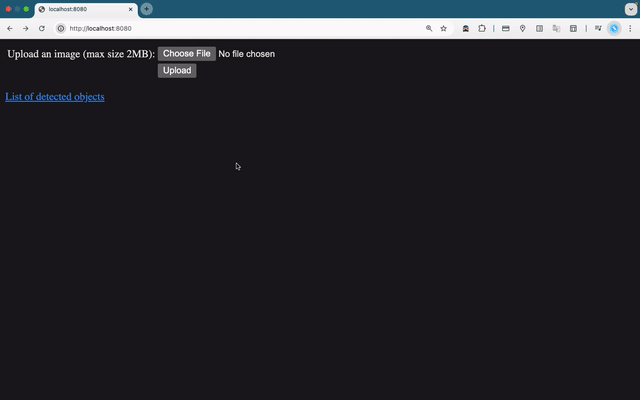
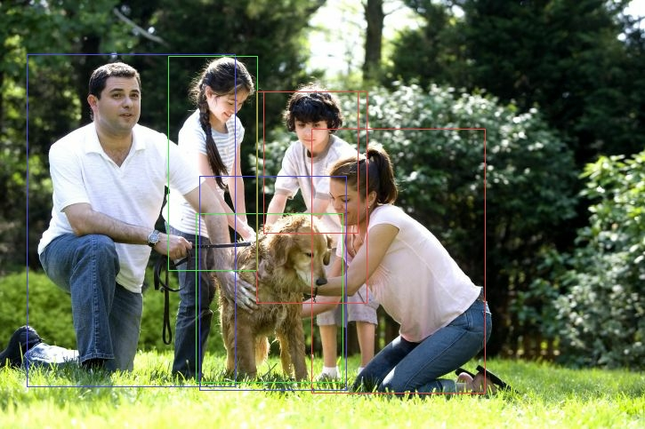

# Spring-MySQL-TF-Detection

## About

This application is a simple example of deploying an object detection model. The following functionalities are provided:

1. Receive and store images from the client
2. Inference client-uploaded images and generate corresponding new images with bounding boxes
3. Store and show the information about detected objects in the database

Here's an example workflow:



And here's the result image with bounding boxes: 



## Prerequisite
1. Java version 21 or higher (with JDK installed)
2. Gradle version 8.12 or higher
3. Locally installed MySQL server

## Get started

### Build and launch the application

1. Download the Mobilenet model
    ```bash
   $ MODEL_URL=http://download.tensorflow.org/models/object_detection/tf2/20200711/ssd_mobilenet_v2_fpnlite_320x320_coco17_tpu-8.tar.gz
   $ TAR_PARENT=ssd_mobilenet_v2_fpnlite_320x320_coco17_tpu-8/saved_model
   $ DEST=tf_detection/ssd_mobilenet_v2_fpnlite_320x320-saved_model

   $ mkdir -p ${DEST}

   # Only extract necessary files
   $ curl -L ${MODEL_URL} | tar -xzv --strip-components=2 -C ${DEST} ${TAR_PARENT}/variables ${TAR_PARENT}/saved_model.pb
    ```

2. Launch a local MySQL server, create a database and an authorized user in the MySQL shell

   ```bash
   mysql> CREATE DATABASE tf_detection; -- Create the new database
   mysql> CREATE USER 'springuser'@'%' IDENTIFIED BY 'ThePassword'; -- Creates the user
   mysql> GRANT ALL ON tf_detection.* TO 'springuser'@'%'; -- Gives all the privileges to the new user on the newly created database 
   ```

3. If your MySQL server doesn't run on the default port (i.e. 3306), or you want to connect to a remote MySQL server, modify the `spring.datasource.url` option in the `src/main/resources/application.properties` file.

4. Build and run the application

   ```bash
   $ gradle build && gradle bootRun
   ```

### Basic usage

1. Open your browser and navigate to `http://<your_host_name>:8080` (`http://localhost:8080` when you run this application on your own machine)
2. Click the button "Choose File" to choose your desired image (e.g. `asset/image.jpg`)
3. Click the button "Upload"
4. Wait until the website finish loading
5. Download a result image by clicking the link with its filename.
6. Check the information of detected objects by clicking the link with name "List of detected objects"

### Additional information

* During the lauching phase, this applicaiton will create two folders inside the `tf_detection` directory if they are not exists, namely `upload-dir` and `result-dir`. The former stores the original images that uploaded by the user, and the latter one stores the images with bounding boxes. The data inside these folders will be cleaned every time you launch this application.

* Each detection result contains the following information:
   * `id`: Object ID
   * `label`: Object label according to the COCO dataset standard (2017)
   * `score`: Confidence score
   * `ymin`, `xmin`, `ymax`, `xmax`: Bounding box information

* All the information of detected objects is stored in the database. The database is renewed every time you launch this application. You can change this behavior by modifying the `spring.jpa.hibernate.ddl-auto` option in the `src/main/resources/application.properties` file.

* The default size limitation of images is 2 MB. You can change this behavior by modifying the `spring.servlet.multipart.max-file-size` option and the `spring.servlet.multipart.max-request-size` option in the `src/main/resources/application.properties` file.
